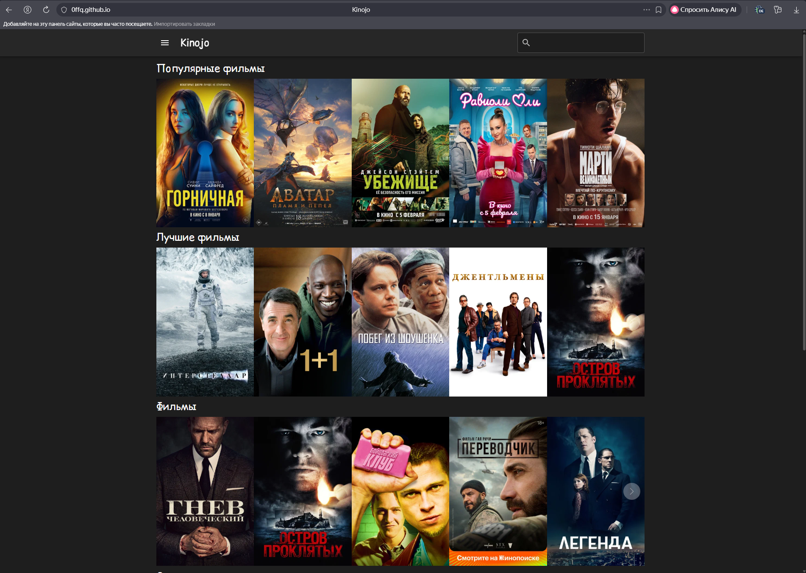
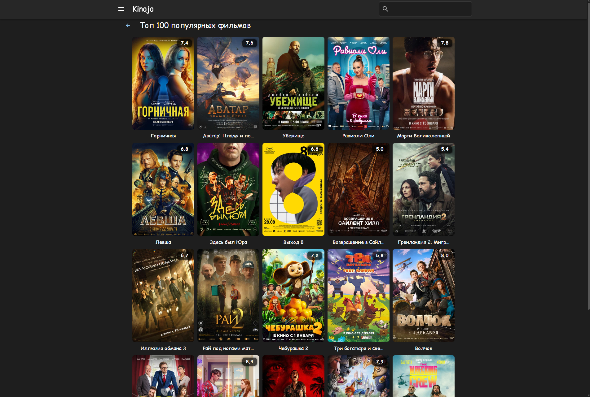
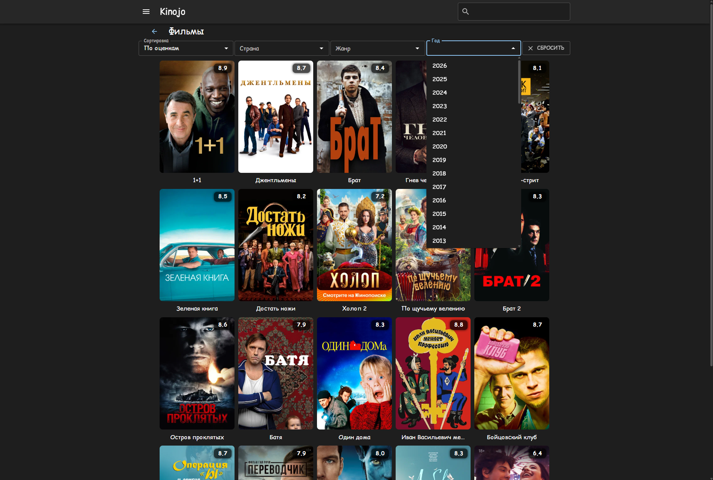
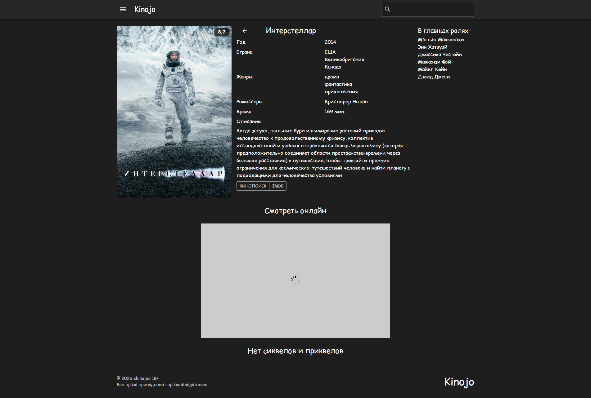
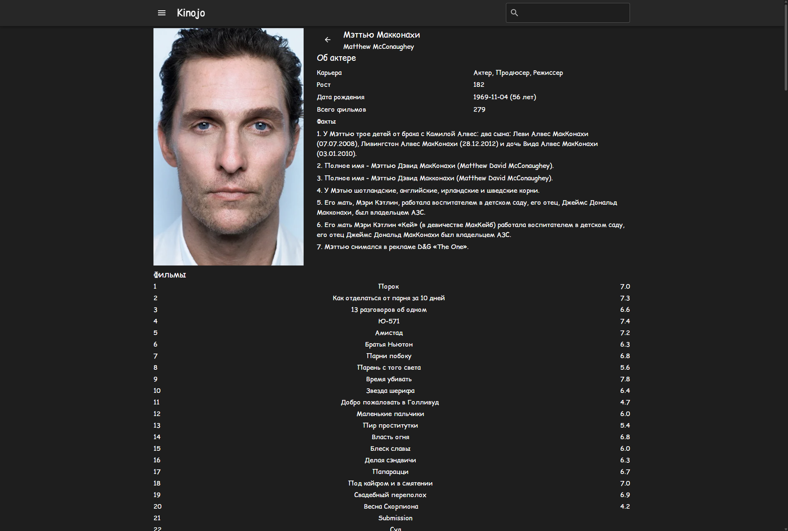

# 🎬 Kinojo — Онлайн киносайт

  

## 🛠️ Стек технологий

### 🎨 Фронтенд

  
  
  
  
  

### ⚙️ Бэкенд и данные

  
  
  
  

### 🛠 Инструменты разработки

  
  
  
  
  
  

### 🚀 Деплой

  

---

## 🔗 Ссылка на сайт

👉 **[https://0ffq.github.io/Kinojo/](https://0ffq.github.io/Kinojo/)**

> ⚠️ **Важно:** Онлайн просмотр фильмов на сайте невозможен из‑за ограничений API.  
> 📌 При правильном подключении базы данных смотреть можно только самому, другим — недоступно.

---

## 🖥️ Скриншоты интерфейса

  
    
  
    
  
    
  
    
  

